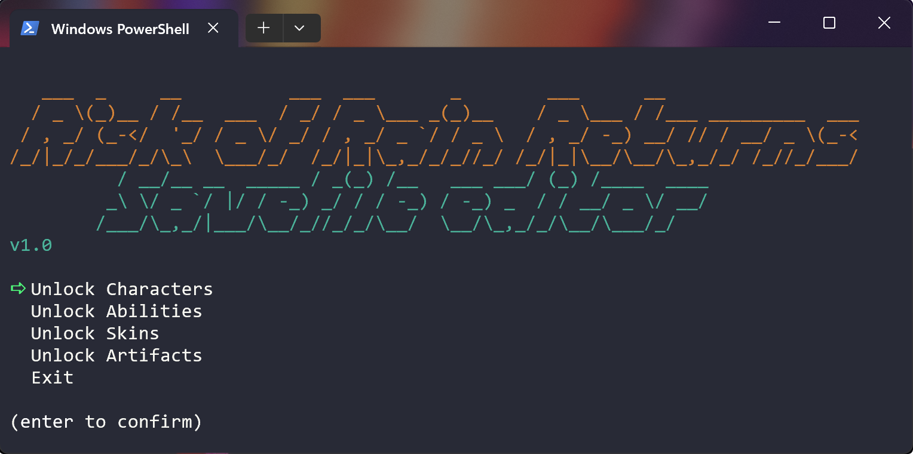

<br/>
<div align="center">
  <div align="center">
    
  </div>
  <h1 align="center">RoR save editor</h1>
  <div align="center">Risk of Rain Returns save file editor.</div>
</div>
<br/>

## About The Project
Initially this project was a development of the program by [PhoenixRem1x](https://github.com/PhoenixRem1x/RoRR-Save-Editor), but later it was completely redesigned and supplemented by [gameplay.tips guide](https://gameplay.tips/guides/risk-of-rain-returns-unlock-characters-and-abilities-through-save-file-cheat-mode.html).

## How To Use
1. Go to `\Steam\userdata\(random folder name)\1337520\remote`
2. Download portable exe file from [`releases page`](https://github.com/markell/ror_save_editor/releases) and put program in a folder mentioned above or choose save file from program file picker
3. Run program 

## Compatibility
Editor works with Windows 10/11
Tested on game version `1.0.5`.

## Requirements
- python3
- [beaupy](https://github.com/petereon/beaupy/)
- Tkinter 

## Installation
From source:

```sh
git clone https://github.com/markell/ror_save_editor.git
poetry build
pip install ./dist/ror_save_editor-{{some-version}}-py3-none-any.whl
```

### To Do
- [ ] Game wiki link system
- [ ] Translation to all in game languages
- [ ] Original Risk of Rain game support

## Problems/New Features?
This is my first python project, various bugs are possible.
In any case, ask for support [here](https://github.com/markell/ror_save_editor/issues).